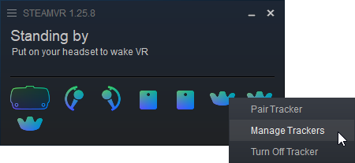
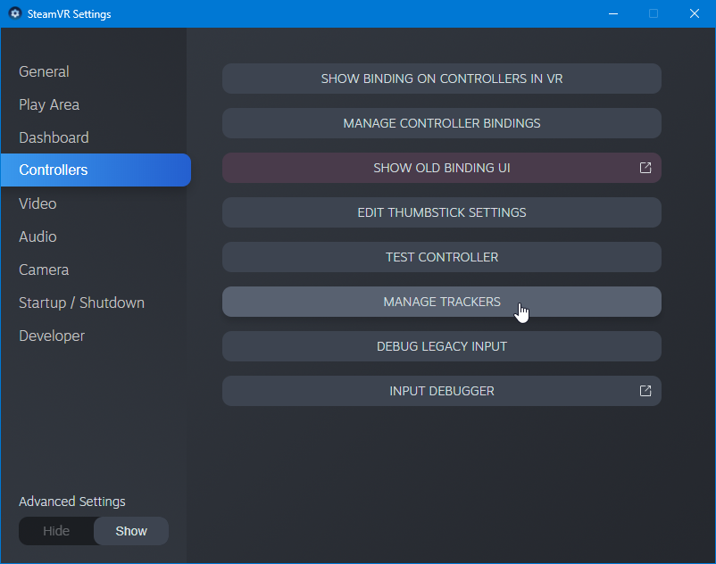
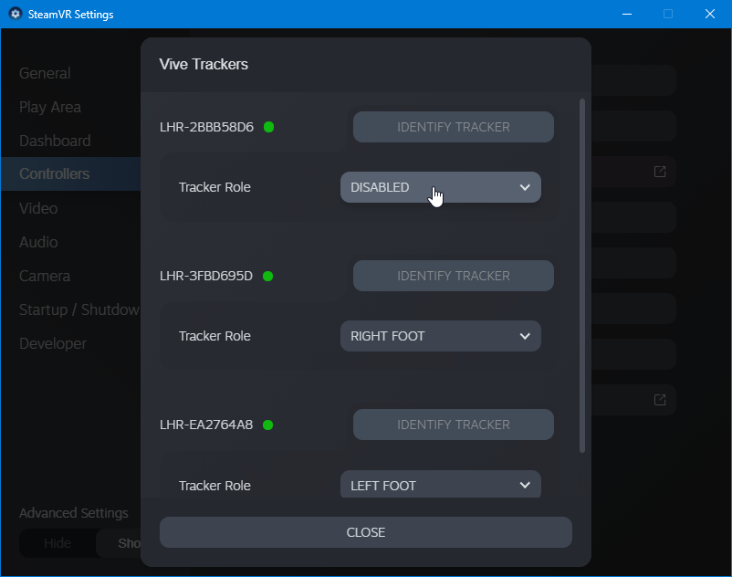
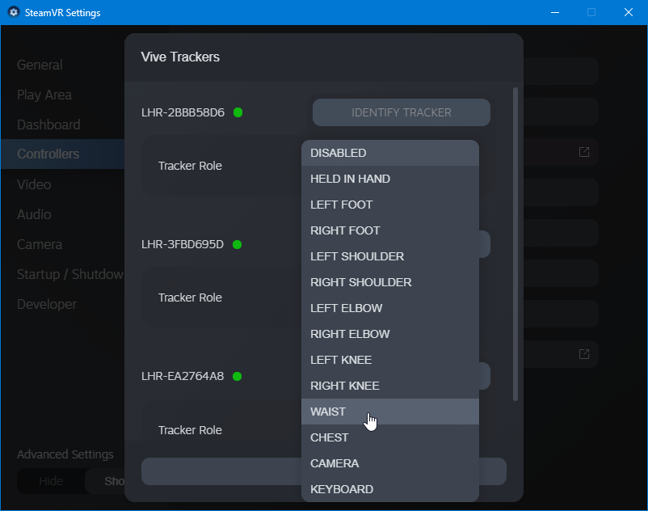
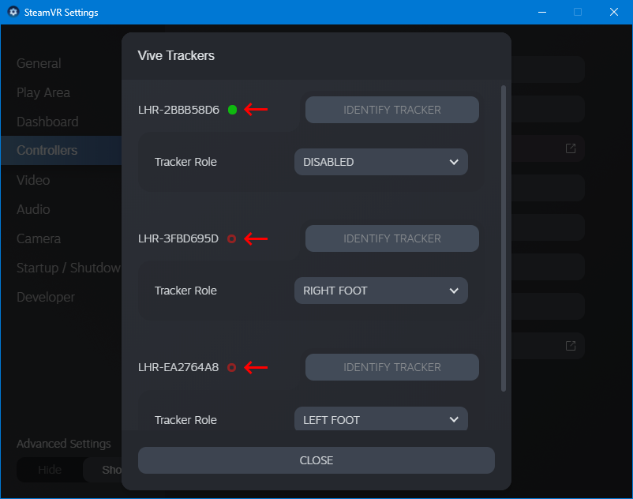

# OpenXR Tracker Profiles
A Beat Saber mod that adds profiles to OpenXR to support more devices such as Vive Trackers.

> **Note**
> There is currently a limitation in Unity's OpenXR implementation that prevents trackers from being recognized if turned on **after** the game is started. If you do this, you will need to restart the game before trackers are recognized in-game. [This Unity Forum thread](https://forum.unity.com/threads/openxr-detecting-vive-tracker-connection-after-launching-the-app.1418659/) is the latest information I could find regarding the situation. There is unfortunately nothing I can do about this since from what I've gathered this is an issue on the native side.

## Installation
Simply put `OpenXRTrackerProfiles.dll` in your game's `Plugins` folder. There is no additional configuration necessary on the game's side.

### Assigning SteamVR Tracker Roles
For trackers to show up in-game, you will need to assign roles to your trackers through SteamVR.

To do so, right-click on any tracker and press "Manage Trackers." You can also open the SteamVR context menu, press "Settings", and press "Controllers."



Then, press "Manage Trackers" again.



You will be presented with a list containing your trackers.



Simply select a value in the dropdown list to assign the tracker to that role. **Note that due to how OpenXR works, only one tracker per role will be recognized by the game at a time**. Press "Close" to save your settings.



For Vive 2.0 trackers (and potentially others), the serial number presented by SteamVR unfortunately is not written down on the device itself. To identify the trackers, I recommend turning them on one at a time so the circle next to the serial number can be used to identify the tracker that is turned on.



That's it! Your trackers should now be usable in-game.

## Usage (for developers)
I highly recommend using the new Unity Input System to access tracked devices with OpenXR. You can technically still use the legacy `UnityEngine.XR.InputDevices` system, but since all controllers and trackers in OpenXR use unique well-defined paths, there is no advantage to using `InputDevices` for trackers specifically anymore. Only a single tracker is available for each role so if, for example, you're trying to set up full body tracking, automatically assuming tracker roles based on position as was previously done is no longer really possible nor necessary.

Accessing trackers using the Input System is fairly straightforward. First, create an `InputAction` for the role you want to track:

```csharp
// Create an InputAction directly
var inputAction = new InputAction("Waist Pose");

// Create an InputAction on an InputActionMap (better if you will be using multiple InputActions):
var inputActionMap = new InputActionMap("My Input Actions");
var inputAction = inputActionMap.AddAction("Waist Pose");
```

Then, add a binding for that action:
```csharp
inputAction.AddBinding("<XRTracker>{Waist}/devicePose");
```

The syntax for the binding path is as follows:
- `<XRTracker>` is the type of `TrackedDevice` to use. It must be enclosed in angle brackets `<>`. For trackers, this should always be `XRTracker`.
- `{Waist}` is the device usage. It must be enclosed in curly brackets `{}`. You can either put a string directly or reference a constant from `OpenXRTrackerProfiles.XRTrackerUsages`. For trackers, this currently includes following values:
  - `LeftFoot`
  - `RightFoot`
  - `LeftShoulder`
  - `RightShoulder`
  - `LeftElbow`
  - `RightElbow`
  - `LeftKnee`
  - `RightKnee`
  - `Waist`
  - `Chest`
  - `Camera`
  - `Keyboard`
- `/devicePose` is the path to the control to use. It must begin with a slash `/`. This path can be simply the root input control or can specify a child control, e.g. `/devicePose/position`. You can check all the avaiable options by looking at the available `InputControl`s on the input device (e.g. `XRViveTracker`). For trackers, these are the options:
  - `devicePose` (`UnityEngine.InputSystem.XR.PoseState`): Provides tracking state, position, rotation, velocity, and angular velocity. It has the following child controls:
    - `isTracked` (`float`): Whether or not the device is currently tracked. The value will be 1 if the device is being tracked and 0 if not.
    - `trackingState` (`int`): Which values (position, rotation, velocity, etc.) are currently being tracked. Should be cast to `UnityEngine.XR.InputTrackingState`.
    - `position` (`Vector3`): The current position of the device.
    - `rotation` (`Quaternion`): The current rotation of the device.
    - `velocity` (`Vector3`): The current velocity of the device.
    - `angularVelocity` (`Vector3`): The current angular velocity of the device.
  - `isTracked` (`float`): Whether or not the device is currently tracked. Same as `/devicePose/isTracked`.
  - `trackingState` (`int`): Which values are currently being tracked. Same as `/devicePose/trackingState`.
  - `devicePosition` (`Vector3`): The current position of the device. Same as `/devicePose/position`.
  - `deviceRotation` (`Quaternion`): The current rotation of the device. Same as `/devicePose/rotation`.

You can then enable the action by simply calling `Enable()`.
```csharp
// Single action
inputAction.Enable();

// Action map
inputActionMap.Enable();
```

To access the input's value, simply use `ReadValue`. Note that if the headset has presence detection, a value will only be provided if presence is detected (i.e. if the headset is on the user's head).
```csharp
var pose = inputAction.ReadValue<Pose>();
```
